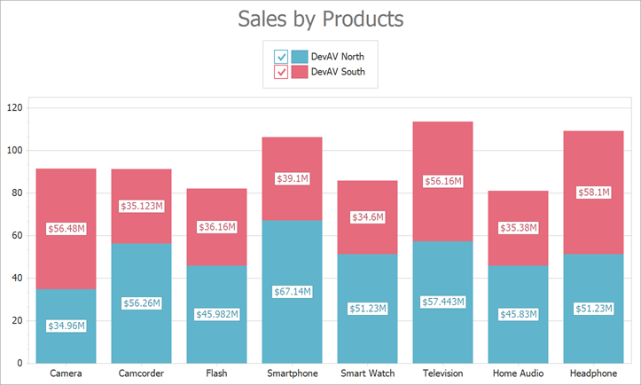

<!-- default badges list -->

<!-- default badges end -->

# How to create a Stacked Bar chart

The following example demonstrates how to create a [Stacked Bar](https://docs.devexpress.com/WindowsForms/2973/controls-and-libraries/chart-control/series-views/2d-series-views/bar-series-views/stacked-bar-chart?p=netframework) chart at runtime.

<!-- default file list -->
## Files to Look At

* [Form1.cs](./CS/Series_StackedBarChart/Form1.cs) (VB: [Form1.vb](./VB/Series_StackedBarChart/Form1.vb))
<!-- default file list end -->

## Documentation

- [Stacked Bar Chart](https://docs.devexpress.com/WindowsForms/2973/controls-and-libraries/chart-control/series-views/2d-series-views/bar-series-views/stacked-bar-chart?p=netframework)
- [Series](https://docs.devexpress.com/WindowsForms/6167/controls-and-libraries/chart-control/series)
- [2D Series Views](https://docs.devexpress.com/WindowsForms/2960/controls-and-libraries/chart-control/series-views/2d-series-views)
- [Provide Data](https://docs.devexpress.com/WindowsForms/5774/controls-and-libraries/chart-control/providing-data)

## More Examples

- [How to create a Side-by-Side Full-Stacked Bar chart](https://github.com/DevExpress-Examples/how-to-create-a-side-by-side-full-stacked-bar-chart-e2093)
- [How to create a Side-by-Side Stacked Bar chart](https://github.com/DevExpress-Examples/how-to-create-a-side-by-side-stacked-bar-chart-e2092)
<!-- feedback -->
## Does this example address your development requirements/objectives?

 

(you will be redirected to DevExpress.com to submit your response)
<!-- feedback end -->
